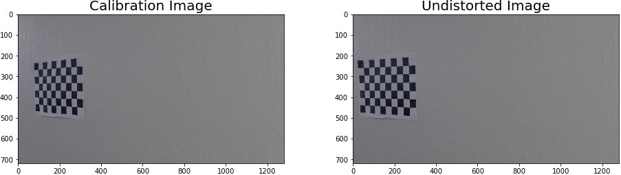
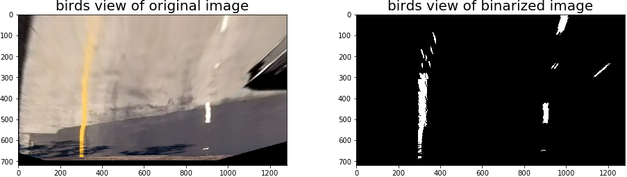

## Advanced Lane Finding

The goals / steps of this project are implemented in Jupyter Notebook and following are the descriptions:

* Compute the camera calibration matrix and distortion coefficients given a set of chessboard images.
* Apply a distortion correction to raw images.
	*  Implemented & tested in Jupyter Notebook Cell # 4 thru 7.
	*  
* Use color transforms, gradients, etc., to create a thresholded binary image.
	*  Implemented & tested in Cell # 8 & 9.
	*  
* Apply a perspective transform to rectify binary image ("birds-eye view").
	*  Implemented & tested in Cell # 10 & 11.
	*  
* Detect lane pixels and fit to find the lane boundary.
	* 	Used the source code from classwork & tested in Cell # 10 & 11.
	*  Per my theoretical understanding this should be a better way to go for lane detection, however I had issues using this down the pipeline processing for the video. So I have used the histogram based approach for detecting lanes in pipeline.

* Determine the curvature of the lane and vehicle position with respect to center.
	*  Implemented in Cell # 15.
	*  Some where in a google search found the below conversion factor for pixel to meters conversion `(forgot the link unable to refernce here)`

		```
			## define pixel convertions to meter unit
			ym_per_pix = 30/720
			xm_per_pix = 3.7/700

		```
* Warp the detected lane boundaries back onto the original image.
* Output visual display of the lane boundaries and numerical estimation of lane curvature and vehicle position.
	*  This submission also includes the following files
		*  `line.py`  - Line class definition from coursework
		*  `lanefinder.py` - Implements the mothods for finding histogram peaks and the X,Y coordinates for left lane and right lane
	*  Cell # 19 tests the all the above mentioned methods in an image processing pipeline and displays the output
	*  

## Results and Discussion

The test images and processed through the pipeline and the results are saved in `output_images` folder. The pipeline was able to successfully process the `project_video.mp4`, the result is stored in `output_project_video.mp4`, where as challenge video & the harder challenge video failed somewhere in the middle of its processing. When I investigated deep into the reasons for failure, it was mostly due to the lane completely missing on the lower half of the image when binarized, this could be possibly addressed by tuninig the threshold parameters. I also attempted to implement late fitting using convolution methods, but that doesn't seems to work for me proerly this may need to improve the model and the thresholds right.

## Video

[Project Video](./output_project_video.mp4)

## Distort Test images

Added folder `undistorted_image` with the given test & calibration images transformed/undistorted using camera matrix `M` and distortion coefficient `DIST` in the Jupyter Notebook.
