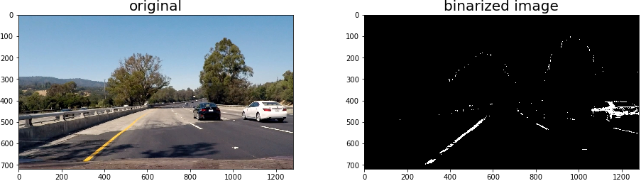

# Advanced Lane Finding

The goal this project is to implemente a image processing pipeline based on Computer Vision methods to identify Street Lanes and compute radius of curvature to predict how much the lane turns and estimate the location of the car in between the two lane lines. The assumption is that the camera is mounted at the front of the car, positined right in the center.


## Camera Calibration

Camera calibration is the first and foremost operation in any computer vision project. Due to inherent nature of way the camera works, the images are typically tend to be distorted due to various factors such as focal length, scaling & skew factors, lens distortion etc.

Chess board images are used to calculate the distortion introduced by the camera with which OpenCV provides methods to determine the calibration matrix for the camera. `cv2.findChessboardCorners` provides the image points for the chessboard corners and since the expected object points are determined based on the chessboard size the repeatable nature of chessboard patterns. `cv2.calibrateCamera` returns the calibration matrix and the distortion coefficients. 

* Apply a distortion correction to raw images.
	*  Implemented & tested in Jupyter Notebook Cell # 4 thru 7.
	*  


## Image Transformations

Preprocessing images, such as, grayscaling, color transformation, apply gradients on a specific color scale etc. facilities the identification of objects of interest in an image. 

Experimented with `HLS` and `LUV` color spaces in to enhnace yellow lanes better under different shades. Applied a color transformation to `HLS` space and added some thresholds on `S-Channel` 

Based on the instructions from coursework, applied Sobel-X filter to identify edges along the X-axis to filter out vertical edges (lanes lines).

Grayscaling is also applied and combined with the S-channel thresholds to create a binarized image for further processing. The method `binarizeImage` implemented in cell # 10 

*  Implemented & tested in cell # 10 & 11.

	

Generally, objects in the far-away distance appear smaller when compared to the objects that are nearby. This perspective view is same for human-eye as well as for a camera. Applying transformations to nullify the perspective view will help identify precise physical characteristics for an object. In our case, applying perspective transformation will help determine if the lane lines are curving towards the end of the road in the image.

* Apply a perspective transform to rectify binary image ("birds-eye view").
	*  Implemented & tested in Cell # 10 & 11.
	*  

#### Histogram Search for Lane Lines

As explained in the coursework, follow the below steps to narrow down or identify the lane line location. Implemented in the method `lanefinder.sliding_window_search`

> * Focus the processing on the bottom portion of the image where the lane lines are expected to appear
> * Split the bottom portion further into smaller search window, first by using horizontal sliding windows that can sweep through the image `ln:10-20`
> * On every window obtain a histogram whichs indicates the presence/location of the pixel away from the y-axis. Split the pixels vertically to resolve pixels on the left hand side as left-lanes and pixels on the right hand side as right lanes. `ln:47-142`
> 

 


#### Smoothing & Radius of Curvature

Smoothing the results across the consecutive images helps to avoid dramatic changes in lane line predictions under different road conditions and shades etc.  

```
    left_line_window1 = np.array([np.transpose(np.vstack([left_lane.bestx-margin, ploty]))])
    left_line_window2 = np.array([np.flipud(np.transpose(np.vstack([left_lane.bestx+margin, ploty])))])
    left_line_pts = np.hstack((left_line_window1, left_line_window2))
    right_line_window1 = np.array([np.transpose(np.vstack([right_lane.bestx-margin, ploty]))])
    right_line_window2 = np.array([np.flipud(np.transpose(np.vstack([right_lane.bestx+margin, ploty])))])
    right_line_pts = np.hstack((right_line_window1, right_line_window2))

```


Since we have the lanes identified from an image with perspective transformation is applied, the polynomial fit on the left & right lane will directly help determine the radius of curvature of the road at the far end of the image.

```
	left_curverad = ((1 + (2*left_fit_cr[0]*y_eval*ym_per_pix + left_fit_cr[1])**2)**1.5) / np.absolute(2*left_fit_cr[0])
	right_curverad = ((1 + (2*right_fit_cr[0]*y_eval*ym_per_pix + right_fit_cr[1])**2)**1.5) / np.absolute(2*right_fit_cr[0])

```

Using below conversion to get radius of curvature in meters

```
	# Define conversions in x and y from pixels space to meters
	ym_per_pix = 30/720 # meters per pixel in y dimension
	xm_per_pix = 3.7/700 # meters per pixel in x dimension
```


*  Cell # 15 tests the all the above mentioned methods in an image processing pipeline and displays the output
  

## Results and Discussion

The test images and processed through the pipeline and the results are saved in `output_images` folder. The pipeline was able to successfully process the `project_video.mp4`, the result is stored in `final_project_video.mp4`. The project may still need some more experimetation with the combination of color spaces and various thresholds to identify lane lines and ignore other aspects on the street. Haven't really tried this project under poor light condition which may demand totally different threshold levels and filters in the image processing pipeline.


## Video

[Project Video](./final_project_video.mp4)

## UnDistort Test images

Added folder `undistorted_image` with the given test & calibration images transformed/undistorted using camera matrix `M` and distortion coefficient `DIST` in the Jupyter Notebook.
